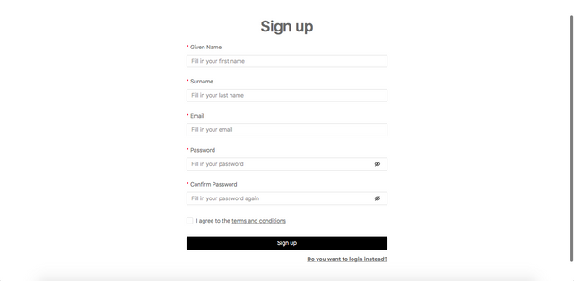
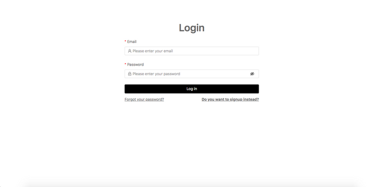
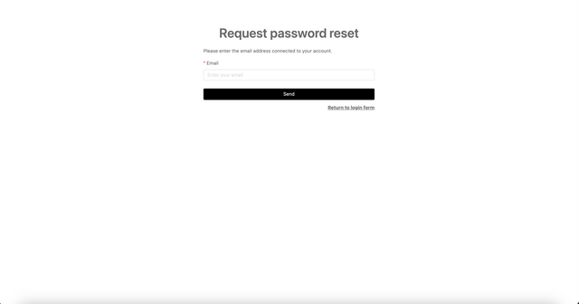
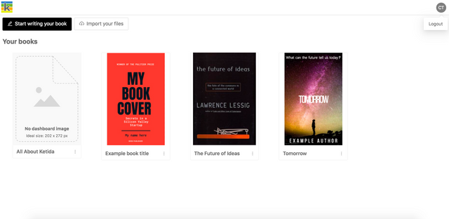

Sign up
-------

Anyone who wants to use Ketty must sign up before creating books or being added as a book collaborator. When you visit the Ketty site, you will be required to provide the following information to sign up:

*   Given name
    
*   Surname
    
*   Email
    
*   Password
    
*   Confirmation of password.
    

Sign up page

Once these details have been entered and you click ‘Sign up’, you will receive a verification request via email, and will need to click the link in the email to verify your email address.

Once this verification has been done, you can log in to Ketty using those same credentials, and can then be added to others’ books or create your own.

Log in
------

Once signed up, you can log in with the email and password you used to sign up.

Login page

If you forgot your password, you can click ‘Forgot your password?’ and will receive an email to reset your password once you enter the associated email.

Reset password page

Logout
------

At any point, you can log out by clicking on your username initials in the top right corner of the site and then clicking ‘Logout’.

Logout from the top navigation bar