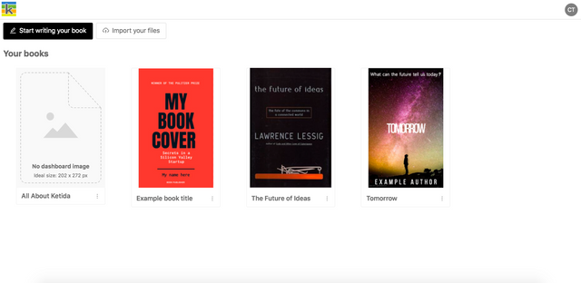
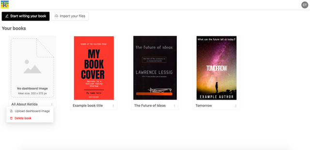

Once signed in, you will see the Books Dashboard. The dashboard shows all of the books that you have created, as well as all of the books that you have access to as a collaborator. Books are shown in alphabetical order.

The Books Dashboard

Create a book
-------------

If you want to write your book directly in Ketty, click ‘Start writing your book’. If you have Word docx files that you would like to upload immediately instead, click ‘Import your files’. See the next chapter for more information on these flows.

Upload a dashboard image for your book
--------------------------------------

The three dots next to each book’s name show a menu that includes the ability to upload a dashboard image for your book. When you click ‘Upload dashboard image’ your file browser will open and will allow you to pick any image. For best results use an image that is approximately 202 × 272 pixels. The image will be automatically resized if the dimensions do not fit the available space.

To replace an existing dashboard image, repeat the same upload process.

Add or replace an image for your book

Delete a book
-------------

The three dots next to each book’s name show a menu that includes the ability to delete a book. This action cannot be undone and can only be performed by the book owner (the user who created the book in Ketty).

Delete a book