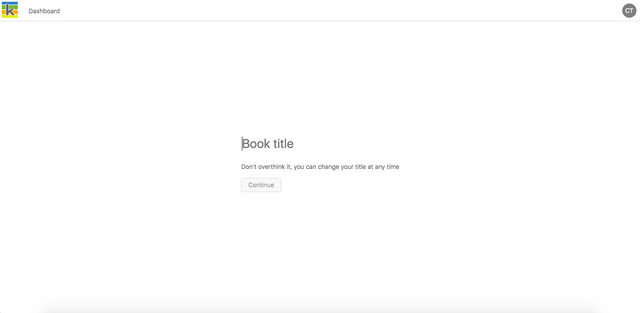
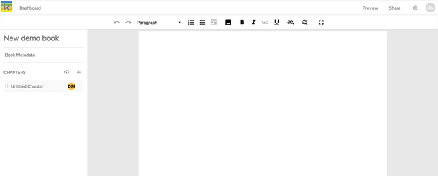
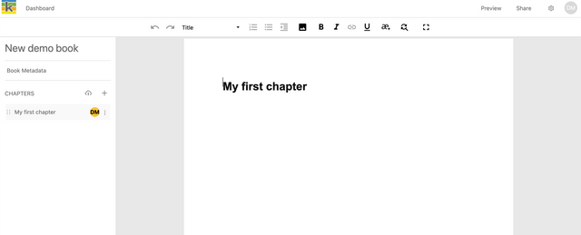
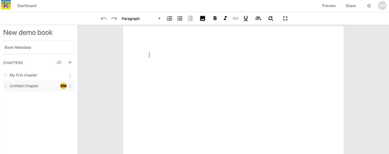
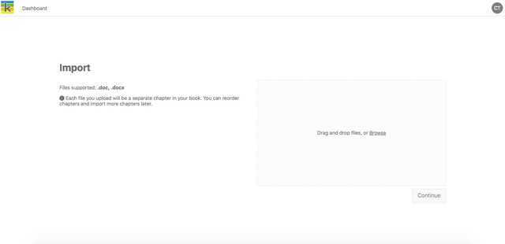
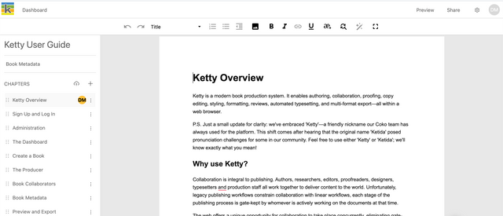

Start writing your book
-----------------------

If you select ‘Start writing your book’ from the Book Dashboard, you will be taken directly to the title page where you can enter a title for your book. The title can be edited at a later stage in the **Book Metadata page**. Type in your title, and click ‘Continue’.

Enter a book title

This will take you to the **Producer page** with a new chapter in view.

To give your chapter a title, write the title text; then select ‘Title’ from the text styling dropdown to apply the style.

To create another new chapter, click the ‘+’ button in the chapter list on the left of the page.

More information about writing and editing your book is available in the following chapters.

Import your files
-----------------

If you select ‘Import your files’ from the Dashboard, you will be taken directly to the Import page where you can bulk upload Word docx files. Each file you upload will be a separate chapter in your book. Drag and drop the files from your file browser or click ‘Browse’ to look for files in your file browser. Once you are done, click ‘Continue’. You can reorder chapters, import more chapters, or create new chapters to write into later.

Import Word docx files

Next, enter a title for your book. The title can be edited at a later stage in the Book Metadata page. Type in your title, and click ‘Continue’ or hit Enter.

This will take you to the Producer page. The files you uploaded will be displayed in the chapter list on the left once they are finished processing.

You can now edit your chapter content and format it as needed. Formatting is generally preserved from your Word docx files including heading levels and images contained in the files.

More information about writing and editing your book is available in the following chapters.