On the top right of the Producer page, you will see a Preview button. This button opens the Preview page.

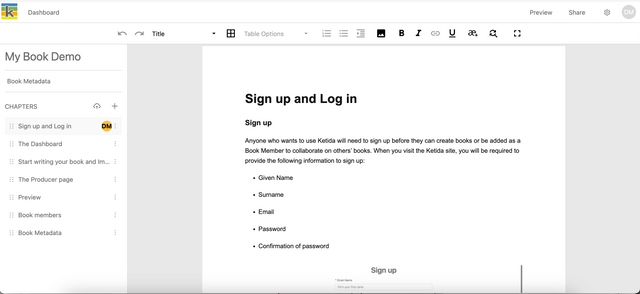

At any point in your production process, you can view a PDF preview or download a PDF or Epub of your book. Important information on the permissions of book collaborators for the Preview page can be found in the Book Collaborators chapter of this guide.

PDF previews and downloads
--------------------------

When you first arrive on the Preview page you will see a default PDF preview. You can choose Epub or PDF, apply a page size (for PDF only), choose which front matter pages you want to include in your book, and choose a design template. When you change these settings the preview regenerates to apply your settings. At any point, you can download the PDF using the Download button at the bottom of the export sidebar.

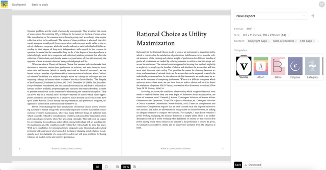

### PDF viewer controls

Controls at the bottom of the PDF preview allow you to change between single and double-page PDF views, and zoom in and out of your PDF. Note that zoom regenerates the preview so you have to scroll back to your page position.

To focus on your preview and hide the export sidebar, click the collapse icon on the top right of the export sidebar. To expand the export sidebar again, repeat the process.

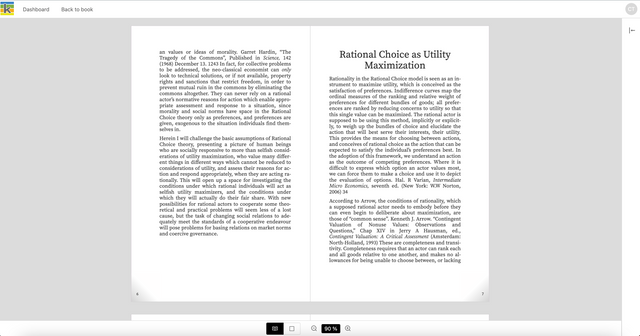

Epub previews and download
--------------------------

Note that Epub preview is not currently available. To download an epub, Select ‘EPUB’ from the format dropdown, select the content you want to include and click ‘Download’. You can preview your epub in an epub reader of choice on your machine. To assign a unique identifier to your epub, use the ISBN dropdown in the export sidebar to select one of the ISBNs that you added to your Book Metadata in the Producer Page.

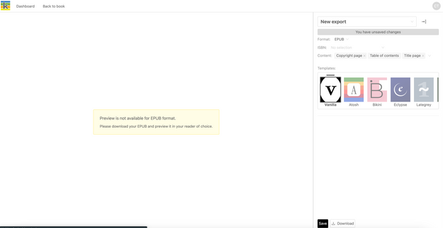

Storing export configurations and connecting to print-on-demand suppliers
-------------------------------------------------------------------------

When you have made any changes to the default preview configuration, you will see a ‘You have unsaved changes’ message. You need to save if you want to store your chosen configuration or connect to print-on-demand services.

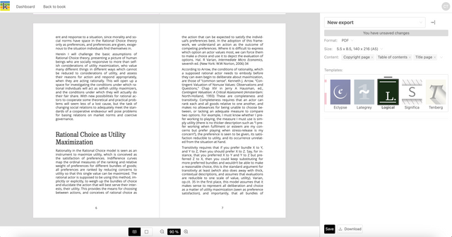

When you click ‘Save’ you will be able to type in a name for your export configuration and click ‘OK’. You can create and store multiple export configurations, each for different export variations of a book.

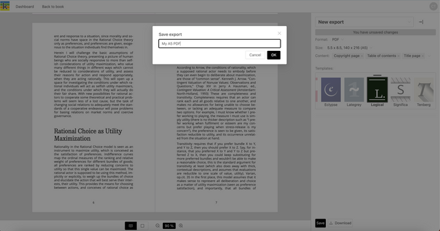

Once you have saved, you will be able to connect to a print-on-demand supplier if this has been enabled in your instance of Ketty. Integration with Lulu’s international print-on-demand network is currently being trialled.

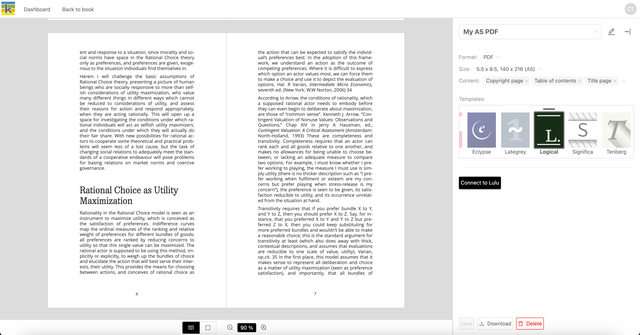

Once you choose ‘Connect to Lulu’ and log in to the print-on-demand supplier’s website, you are redirected back to Ketty, where you will be able to choose to upload your export to that supplier.

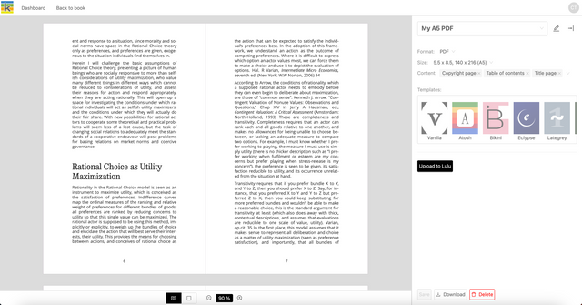

Once uploaded, a message to indicate that the export has been synced successfully will appear. A button to open that export on the relevant supplier website will also appear.

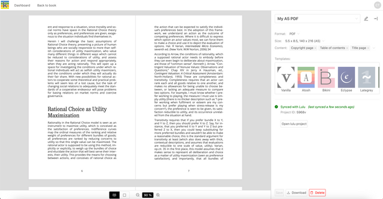

Any changes made after syncing, for example to your book content, metadata, or export configuration, will result in an out-of-sync message being shown. At this point, you can choose to resync your export.

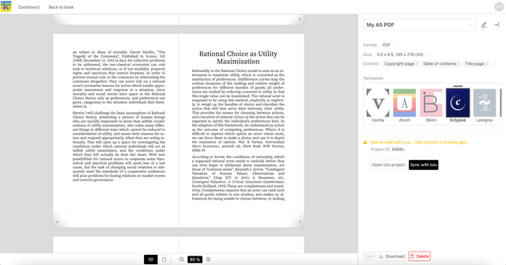

Once you choose to sync again, you will see confirmation that your version on Ketty and the version on the supplier’s site are in sync.

To create another export configuration, click on the current export name to access the dropdown of exports, and click ‘New export’. Follow the same process to create and save your export configuration, and connect to print-on-demand suppliers.

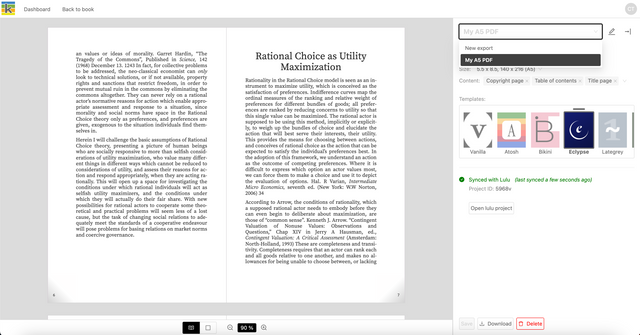

To change the name of an existing export, click the pen icon next to the export’s name, edit the name in the modal that appears, and click ‘OK’.

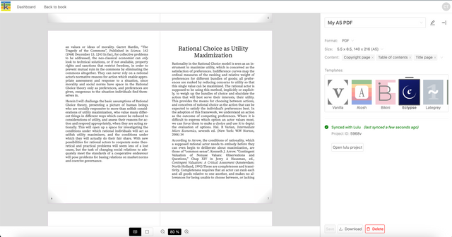

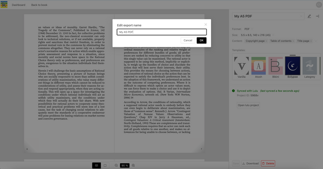

You can delete an export configuration at any time, by using the delete button at the bottom right of the export sidebar. Deleting an export configuration in Ketty will not delete the corresponding export on the print-on-demand supplier’s website, which needs to be done separately.